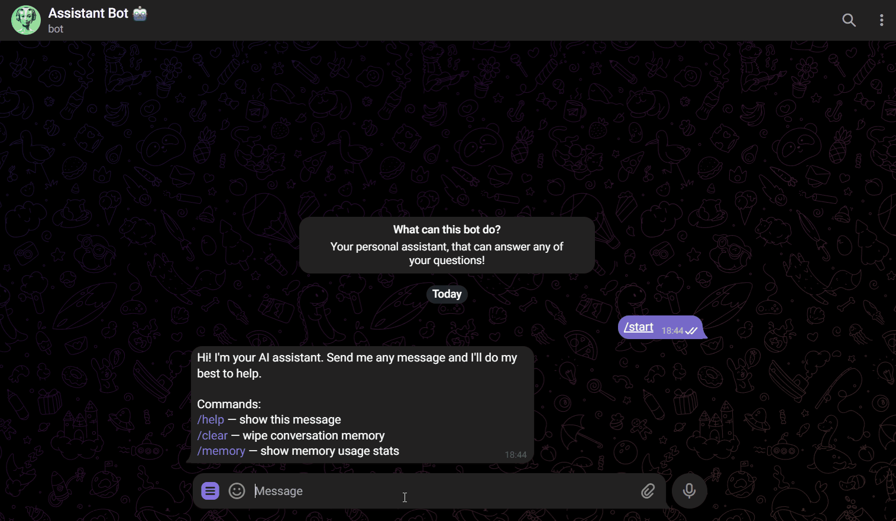

# PaAi — Personal Assistant AI

> A Telegram chatbot with persistent, token-aware conversation memory and a pluggable LLM backend, built on a decoupled FastAPI service. Powered by Claude (Anthropic) by default.

PaAi is a conversational assistant you talk to on Telegram. It remembers the context of your conversation across messages (and across restarts), answers in natural language, and is built so the AI engine can be swapped — cloud or local — without touching the chat interface.

---

## Demo

<!--
  📹 DEMO PLACEHOLDER
  Record a short GIF showing: (1) a greeting with your name, (2) a follow-up
  that proves memory recall, (3) the /memory command. Save it as:
      assets/demo.gif
  and it will render here automatically. (Create the assets/ folder if needed.)
-->



*A real conversation showing PaAi recalling earlier context within the same chat.*

---

## Features

- 💬 **Natural conversation** on Telegram (private chats and groups — in groups it only responds when mentioned)
- 🧠 **Persistent memory** — conversations are stored in SQLite and survive restarts, scoped per chat
- 📏 **Token-aware context window** — sends as much recent history as fits a configurable token budget, trimming oldest-first
- 🔌 **Pluggable LLM backend** — Claude (cloud, default) or Ollama (local), selected by a single env var
- ⚙️ **Configuration via environment** — no secrets in code
- 🛡️ **Graceful error handling** — empty input is guarded, backend failures degrade to a friendly message instead of crashing
- 🧪 **Tested & evaluated** — unit tests for the memory layer plus a behavioral evaluation suite run against the live model
- 🤖 **Commands** — `/start`, `/help`, `/clear` (wipe memory), `/memory` (show usage stats)

---

## Architecture

PaAi runs as **two decoupled processes**: a thin Telegram interface and a FastAPI "brain." The interface knows nothing about LLMs or memory — it just relays messages over HTTP. This separation means the same backend could serve a web UI, a CLI, or any other front-end without changes.

```
┌──────────────┐   text    ┌──────────────────┐  POST /chat    ┌──────────────────────┐
│   Telegram   │──────────▶│     bot.py       │──────────────▶│        api.py        │
│   (user)     │◀──────────│ (python-telegram │◀──────────────│      (FastAPI)       │
└──────────────┘   reply   │  -bot, polling)  │   response     │                      │
                           └──────────────────┘                │  ┌────────────────┐  │
                                                               │  │ MemoryManager  │  │
                                                               │  │ token-aware    │  │
                                                               │  │ window         │  │
                                                               │  └───────┬────────┘  │
                                                               │          │           │
                                                               │  ┌───────▼────────┐  │
                                                               │  │  SQLite (DB)   │  │
                                                               │  │ conversations  │  │
                                                               │  │ + messages     │  │
                                                               │  └────────────────┘  │
                                                               │          │           │
                                                               │  ┌───────▼────────┐  │
                                                               │  │  LLMProvider   │  │
                                                               │  │ (factory)      │  │
                                                               │  └───┬────────┬───┘  │
                                                               └──────│────────│──────┘
                                                                      ▼        ▼
                                                              ┌──────────┐ ┌──────────┐
                                                              │  Claude  │ │  Ollama  │
                                                              │ (cloud)  │ │ (local)  │
                                                              └──────────┘ └──────────┘
```

**Request flow:** a user message hits `bot.py` → forwarded to `POST /chat` → the message is persisted → `MemoryManager` builds a token-budgeted context window from history → the configured `LLMProvider` generates a reply → the reply is persisted → returned to the user.

### Project structure

```
enhanced-telegram-chatbot/
├── bot.py                  # Telegram interface (polling, commands)
├── api.py                  # FastAPI service: /chat, /memory, /health
├── core/
│   ├── config.py           # Env-based settings (pydantic-settings)
│   ├── llm/
│   │   ├── base.py         # LLMProvider abstract interface
│   │   ├── claude.py       # Claude implementation (async)
│   │   ├── ollama.py       # Ollama implementation (async)
│   │   └── factory.py      # Selects provider from LLM_PROVIDER
│   └── memory/
│       ├── database.py     # Async SQLite access (aiosqlite)
│       └── manager.py      # Token-aware sliding window
├── prompts/system.txt      # System prompt (editable, not hardcoded)
├── eval/
│   ├── cases.json          # Behavioral test cases
│   └── run_eval.py         # Evaluation runner
├── tests/test_memory.py    # Unit tests (no API key needed)
├── requirements.txt
└── .env.example            # Configuration template
```

---

## Key Decisions & Why

**1. Pluggable LLM provider, cloud by default.**
The LLM is hidden behind an `LLMProvider` interface (`chat()` + `estimate_tokens()`), with a 'factory' that picks the implementation from one env var. Claude is the default because it's reliable, requires no local GPU, and is what I predict production systems actually use; Ollama remains a first-class option for local/offline runs. The interface means the rest of the system is never coupled to a vendor — which allows for the addition of new providers, with just one new file.

**2. Token-aware sliding window for memory.**
Rather than a fixed message count, memory is bounded by a **token budget**. On each turn the 'manager' walks history newest-first, accumulating messages until the budget is reached (always keeping at least the last exchange). This keeps requests within the model's limits and costs predictable, while preserving as much recent context as possible. Summarization-based compression — which would retain older context more cheaply — is a deliberate next step, documented below.

**3. SQLite persistence, scoped per chat.**
Conversations are stored in two tables (`conversations`, `messages`) keyed by Telegram's `chat_id`, so memory survives restarts and each conversation is isolated. SQLite was chosen over an in-memory dict (lost on restart) and over a heavier database (unnecessary for this scale) — it's file-based, zero-setup, and portfolio-friendly while still demonstrating real persistence and a schema designed to extend (e.g., adding a `summary` column later requires no rewrite).

**4. Decoupled bot ↔ API.**
Separating the Telegram interface from the FastAPI brain keeps the AI logic reusable and independently testable, and reflects how a real system would separate API interactions from application logic.

**5. Configuration and prompt as data, not code.**
All secrets and tunables come from the environment (`pydantic-settings`), and the system prompt lives in `prompts/system.txt` — both editable without touching application code.

---

## Evaluation

A chatbot that runs isn't the same as a chatbot that *works*. PaAi includes a small behavioral evaluation suite (`eval/run_eval.py`) that runs scripted conversations through the live model and checks the final response against expected/forbidden content.

**Categories tested:**

| Case | Category | What it verifies |
|------|----------|------------------|
| `mem-01` | Memory recall | Recalls the user's name from an earlier turn |
| `mem-02` | Memory recall | Recalls a stated preference |
| `err-01` | Error handling | Handles an empty/whitespace message without erroring |
| `honesty-01` | Honesty | Admits a knowable fact rather than hallucinating |
| `scope-01` | Coherence | Stays coherent across a multi-turn technical exchange |

**Latest result: `5/5 passed`.**

Two of these checks earned their place by catching real issues during development:

- **`err-01` caught a product bug.** A whitespace-only message was being forwarded straight to the model, which rejects empty content with an HTTP 400. The fix was an input guard that handles empty input gracefully *before* the LLM is ever called.
- **`honesty-01` caught a flaw in the eval itself.** The model answered the "population of Mars" question perfectly ("0 — no humans live on Mars"), but the test initially failed because it required *all* listed synonyms to appear. That was a poorly specified assertion, not a bad answer — so the framework gained `expected_any` (at-least-one-match) semantics. A reminder that evaluation harnesses need scrutiny too.

Run it yourself (requires a configured provider):

```bash
python eval/run_eval.py
```

---

## Testing

Unit tests cover the memory layer in isolation — no API key or network needed (they use a mock provider and a temporary database):

```bash
python -m pytest tests/ -v
```

They verify message storage and retrieval, memory clearing, **conversation isolation** (one chat can't see another's history), and that the token window trims oldest-first when over budget. Current status: `4/4 passed`.

---

## Setup & Running

### Prerequisites
- Python 3.10+ (tested on 3.11 and 3.14)
- A Telegram bot token (from [@BotFather](https://t.me/BotFather))
- An Anthropic API key (from [console.anthropic.com](https://console.anthropic.com)) — or a local [Ollama](https://ollama.com) install

### 1. Install
```bash
python3 -m venv .venv
source .venv/bin/activate          # Windows: .venv\Scripts\activate
pip install -r requirements.txt
```

### 2. Configure
```bash
cp .env.example .env
```
Edit `.env` and set at minimum `TELEGRAM_TOKEN`, `BOT_USERNAME`, and `CLAUDE_API_KEY`. To run locally instead, set `LLM_PROVIDER=ollama`.

### 3. Run (two terminals)
```bash
# Terminal 1 — the API
uvicorn api:app --reload

# Terminal 2 — the bot
python bot.py
```
Message your bot on Telegram. Try: introduce your name, then ask the bot to recall it; use `/memory` to inspect context usage and `/clear` to reset.

---

## Known Limitations & Future Work

- **Memory is a sliding window, not summarization.** Very old context is dropped rather than compressed. *Next step: summary-based memory that condenses older turns into a running summary.*
- **No authentication on the API.** The `/chat` endpoint is open and assumes a trusted local network. Production would need an API key or token check.
- **Conversations are stored in plaintext.** Data is isolated per `chat_id` but not encrypted at rest. *Next step: encryption at rest.*
- **Polling, not webhooks.** Fine for development and demos; webhooks would be the production choice for latency and scale.
- **Voice (TTS/STT) is not included.** An earlier internship version supported voice messages (gTTS + Google Speech). It was deliberately scoped out here to keep the project focused on core LLM-application skills, and is a natural future extension.

---

## Background & Learnings

PaAi is the first portfolio project in my deliberate transition from software developer to **AI Engineer**, documented in my [learning roadmap](../ROADMAP.md). It began as a chatbot I built during my degree internship (*Estágio*) and was rebuilt from the ground up to demonstrate the fundamentals of a production-minded LLM application: API integration, conversation memory, structured configuration, error handling, and — importantly — *measuring* whether the system actually works.

A few things I took away from the rebuild:

- **The original had a hardcoded API token, global mutable state shared across all users, and an in-memory dict that vanished on restart.** Reworking these into env-based config, per-chat isolation, and SQLite persistence was a lesson in the gap between "it runs" and "it's sound."
- **Evaluation changes how you build.** Writing behavioral tests surfaced a real input-handling bug and forced me to fix my own eval logic — exactly the kind of feedback loop the role demands.
- **Modern Python moves fast.** Getting it running on Python 3.14 meant resolving a native-wheel build failure (dependencies too old for the interpreter) and two 3.12+ asyncio/`requests` issues — practical environment-debugging that doesn't show up in tutorials.

The goal was never the most advanced chatbot possible — it was a clean, honest, well-measured demonstration of the core technologies, built to be understood.
