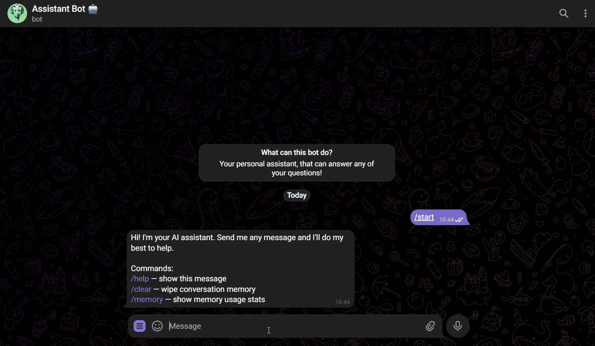

# PaAi — Personal Assistant AI

> PaAi is a Telegram chatbot. It keeps a memory of each conversation. The memory survives restarts. PaAi uses a pluggable LLM backend and runs on a decoupled FastAPI service. By default, PaAi uses Claude (Anthropic).

PaAi is a conversational assistant. You talk to PaAi on Telegram. PaAi remembers the context of your conversation across messages and across restarts. PaAi answers in natural language. The design lets you swap the AI engine, cloud or local, without changing the chat interface.

---

## Demo

<!--
  📹 DEMO PLACEHOLDER
  Record a short GIF. Show three things: (1) a greeting with your name,
  (2) a follow-up message that proves memory recall, (3) the /memory command.
  Save the GIF as:
      assets/demo.gif
  The GIF will render here automatically. Create the assets/ folder first, if it does not exist.
-->



*This is a real conversation. It shows that PaAi recalls earlier context in the same chat.*

---

## Features

- 💬 **Natural conversation** on Telegram. PaAi works in private chats and in groups. In a group, PaAi answers only when a user mentions it.
- 🧠 **Persistent memory** — PaAi stores conversations in SQLite. The memory survives restarts. Each chat has its own memory.
- 📏 **Token-aware context window** — PaAi sends as much recent history as fits a configurable token budget. When the budget is full, PaAi trims the oldest messages first.
- 🔌 **Pluggable LLM backend** — PaAi uses Claude (cloud, default) or Ollama (local). Set one environment variable to select the backend.
- ⚙️ **Configuration through environment variables** — the code holds no secrets.
- 🛡️ **Graceful error handling** — a guard blocks empty input. If the backend fails, PaAi shows a friendly message instead of a crash.
- 🧪 **Tests and evaluation** — unit tests cover the memory layer. A behavioral evaluation suite runs against the live model.
- 🤖 **Commands** — `/start`, `/help`, `/clear` (erase memory), `/memory` (show usage statistics)

---

## Architecture

PaAi runs as **two decoupled processes**: a thin Telegram interface and a FastAPI "brain." The interface does not know about the LLM or the memory. The interface only relays messages over HTTP. Because of this separation, the same backend can serve a web UI, a CLI, or any other front-end without changes.

```
┌──────────────┐   text    ┌──────────────────┐  POST /chat    ┌──────────────────────┐
│   Telegram   │──────────▶│     bot.py       │──────────────▶│        api.py        │
│   (user)     │◀──────────│ (python-telegram │◀──────────────│      (FastAPI)       │
└──────────────┘   reply   │  -bot, polling)  │   response     │                      │
                           └──────────────────┘                │  ┌────────────────┐  │
                                                               │  │ MemoryManager  │  │
                                                               │  │ token-aware    │  │
                                                               │  │ window         │  │
                                                               │  └───────┬────────┘  │
                                                               │          │           │
                                                               │  ┌───────▼────────┐  │
                                                               │  │  SQLite (DB)   │  │
                                                               │  │ conversations  │  │
                                                               │  │ + messages     │  │
                                                               │  └────────────────┘  │
                                                               │          │           │
                                                               │  ┌───────▼────────┐  │
                                                               │  │  LLMProvider   │  │
                                                               │  │ (factory)      │  │
                                                               │  └───┬────────┬───┘  │
                                                               └──────│────────│──────┘
                                                                      ▼        ▼
                                                              ┌──────────┐ ┌──────────┐
                                                              │  Claude  │ │  Ollama  │
                                                              │ (cloud)  │ │ (local)  │
                                                              └──────────┘ └──────────┘
```

**Request flow:** A user sends a message to `bot.py`. `bot.py` forwards the message to `POST /chat`. The API stores the message. `MemoryManager` builds a context window from the history, within the token budget. The configured `LLMProvider` generates a reply. The API stores the reply. The API returns the reply to the user.

### Project structure

```
enhanced-telegram-chatbot/
├── bot.py                  # Telegram interface (polling, commands)
├── api.py                  # FastAPI service: /chat, /memory, /health
├── core/
│   ├── config.py           # Env-based settings (pydantic-settings)
│   ├── llm/
│   │   ├── base.py         # LLMProvider abstract interface
│   │   ├── claude.py       # Claude implementation (async)
│   │   ├── ollama.py       # Ollama implementation (async)
│   │   └── factory.py      # Selects provider from LLM_PROVIDER
│   └── memory/
│       ├── database.py     # Async SQLite access (aiosqlite)
│       └── manager.py      # Token-aware sliding window
├── prompts/system.txt      # System prompt (editable, not hardcoded)
├── eval/
│   ├── cases.json          # Behavioral test cases
│   └── run_eval.py         # Evaluation runner
├── tests/test_memory.py    # Unit tests (no API key needed)
├── requirements.txt
└── .env.example            # Configuration template
```

---

## Key Decisions & Why

**1. Pluggable LLM provider, cloud by default.**
An `LLMProvider` interface hides the LLM. The interface exposes `chat()` and `estimate_tokens()`. A factory picks the implementation from one environment variable. Claude is the default provider. Claude is reliable. Claude needs no local GPU. I predict that production systems use a cloud provider like Claude. Ollama stays as a first-class option for local and offline runs. The interface decouples the rest of the system from any one vendor. A new provider needs only one new file.

**2. Token-aware sliding window for memory.**
A **token budget** bounds the memory, not a fixed message count. On each turn, the manager reads the history from newest to oldest. The manager adds messages until the budget is full. The manager always keeps at least the last exchange. This approach keeps each request within the limits of the model. This approach keeps the cost predictable. This approach preserves as much recent context as possible. A cheaper approach would compress older context through summarization. This is a deliberate next step. See the "Known Limitations & Future Work" section below.

**3. SQLite persistence, scoped per chat.**
Two tables store the conversations: `conversations` and `messages`. Telegram's `chat_id` keys both tables. Because of this, memory survives restarts, and each conversation stays isolated from the others. I chose SQLite over an in-memory dictionary, because a dictionary loses its data on restart. I chose SQLite over a heavier database, because this project does not need that scale. SQLite is file-based. SQLite needs zero setup. SQLite fits a portfolio project well. SQLite still demonstrates real persistence and a schema that extends easily. For example, a later `summary` column needs no rewrite.

**4. Decoupled bot and API.**
The separation of the Telegram interface from the FastAPI brain keeps the AI logic reusable. The separation lets each part be tested on its own. The separation reflects how a real system separates API interactions from application logic.

**5. Configuration and the prompt as data, not code.**
All secrets and tunable values come from the environment, through `pydantic-settings`. The system prompt lives in `prompts/system.txt`. A user can edit both without a change to the application code.

---

## Evaluation

A chatbot that runs is not the same as a chatbot that works. PaAi includes a small behavioral evaluation suite, `eval/run_eval.py`. This suite runs scripted conversations through the live model. This suite checks the final response for expected content and for forbidden content.

**Categories tested:**

| Case | Category | What it verifies |
|------|----------|------------------|
| `mem-01` | Memory recall | PaAi recalls the user's name from an earlier turn |
| `mem-02` | Memory recall | PaAi recalls a stated preference |
| `err-01` | Error handling | PaAi handles an empty or whitespace message without an error |
| `honesty-01` | Honesty | PaAi states a knowable fact instead of a hallucination |
| `scope-01` | Coherence | PaAi stays coherent across a multi-turn technical exchange |

**Latest result: `5/5 passed`.**

Two of these checks found real issues during development:

- **`err-01` found a product bug.** The code forwarded a whitespace-only message straight to the model. The model rejects empty content with an HTTP 400 error. The fix adds an input guard. The guard handles empty input before the code calls the LLM.
- **`honesty-01` found a flaw in the evaluation itself.** The model answered the "population of Mars" question well: "0 — no humans live on Mars." The test still failed at first, because the test required every listed synonym to appear. That assertion was poorly specified, not the model's answer. So the framework gained `expected_any` semantics: at least one match is enough. This case is a reminder that an evaluation harness also needs scrutiny.

Run the suite yourself. The suite needs a configured provider:

```bash
python eval/run_eval.py
```

---

## Testing

Unit tests cover the memory layer in isolation. These tests need no API key and no network connection. These tests use a mock provider and a temporary database:

```bash
python -m pytest tests/ -v
```

The tests verify message storage and retrieval. The tests verify memory clearing. The tests verify **conversation isolation**: one chat cannot see the history of another chat. The tests verify that the token window trims the oldest messages first, when the window goes over budget. Current status: `4/4 passed`.

---

## Setup & Running

### Prerequisites
- Python 3.10 or later (tested on 3.11 and 3.14)
- A Telegram bot token, from [@BotFather](https://t.me/BotFather)
- An Anthropic API key, from [console.anthropic.com](https://console.anthropic.com), or a local [Ollama](https://ollama.com) install

### 1. Install
```bash
python3 -m venv .venv
source .venv/bin/activate          # Windows: .venv\Scripts\activate
pip install -r requirements.txt
```

### 2. Configure
```bash
cp .env.example .env
```
Edit `.env`. Set at least `TELEGRAM_TOKEN`, `BOT_USERNAME`, and `CLAUDE_API_KEY`. To run PaAi locally instead, set `LLM_PROVIDER=ollama`.

### 3. Run (two terminals)
```bash
# Terminal 1 — the API
uvicorn api:app --reload

# Terminal 2 — the bot
python bot.py
```
Send a message to your bot on Telegram. Introduce your name, then ask the bot to recall it. Use `/memory` to check context usage. Use `/clear` to reset the memory.

---

## Known Limitations & Future Work

- **Memory is a sliding window, not a summary.** PaAi drops very old context instead of compressing it. *Next step: build a summary-based memory that condenses older turns into a running summary.*
- **The API has no authentication.** The `/chat` endpoint is open. The endpoint assumes a trusted local network. A production system would need an API key or a token check.
- **Conversations are stored in plaintext.** Each `chat_id` isolates its data, but the data is not encrypted at rest. *Next step: add encryption at rest.*
- **The bot uses polling, not webhooks.** Polling works well for development and for demos. A production system would use webhooks, for lower latency and better scale.
- **Voice input and output (TTS/STT) are not included.** An earlier internship version supported voice messages, through gTTS and Google Speech. I scoped voice out of this version on purpose, to keep the project focused on core LLM-application skills. Voice remains a natural future extension.

---

## Background & Learnings

PaAi is the first portfolio project in my deliberate transition from software developer to **AI Engineer**. I document this transition in my [learning roadmap](../ROADMAP.md). PaAi began as a chatbot that I built during my degree internship (*Estágio*). I rebuilt PaAi from the ground up, to demonstrate the fundamentals of a production-minded LLM application: API integration, conversation memory, structured configuration, error handling, and — importantly — measurement of whether the system actually works.

The rebuild taught me a few lessons:

- **The original version had a hardcoded API token, global mutable state shared across all users, and an in-memory dictionary that vanished on restart.** I reworked these into environment-based configuration, per-chat isolation, and SQLite persistence. This rework was a lesson in the gap between "it runs" and "it is sound."
- **Evaluation changes how you build.** Writing behavioral tests surfaced a real input-handling bug. The same tests forced me to fix my own evaluation logic. This is exactly the feedback loop that the role demands.
- **Modern Python moves fast.** To run PaAi on Python 3.14, I resolved a native-wheel build failure, because some dependencies were too old for the interpreter. I also resolved two asyncio and `requests` issues tied to Python 3.12 and later. This is practical environment debugging that tutorials rarely show.

The goal was never the most advanced chatbot possible. The goal was a clean, honest, well-measured demonstration of the core technologies, built to be understood.
